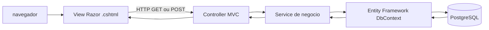
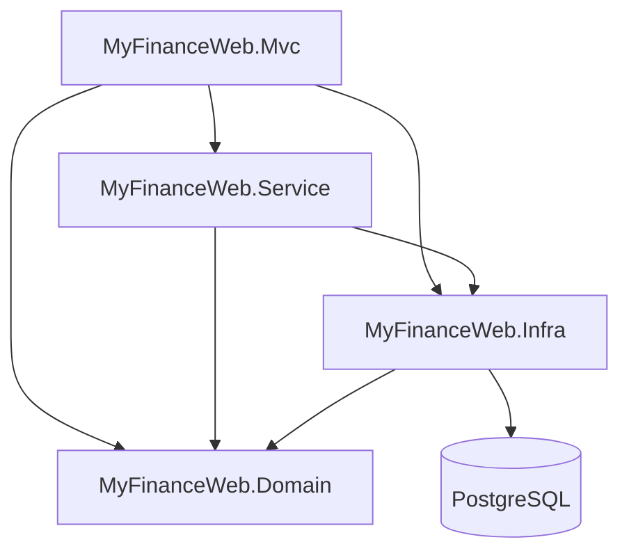
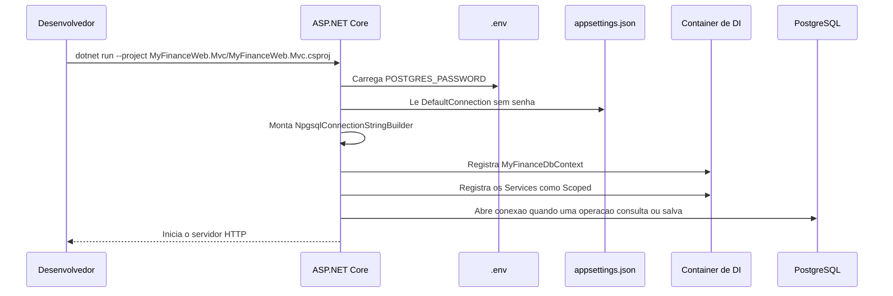
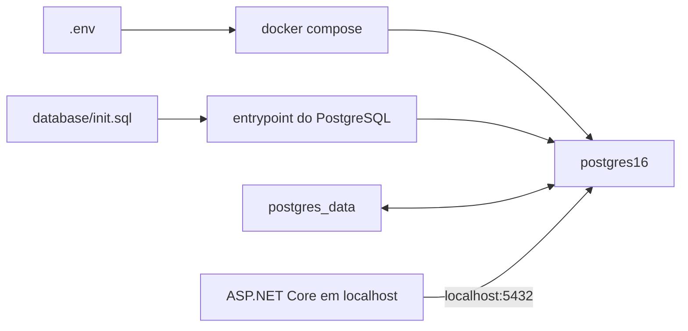
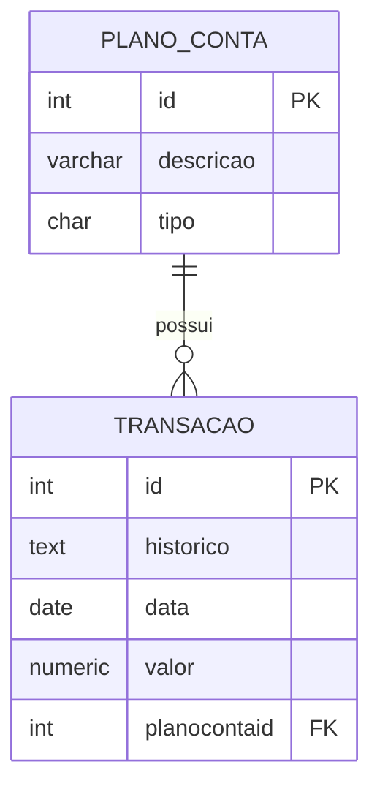
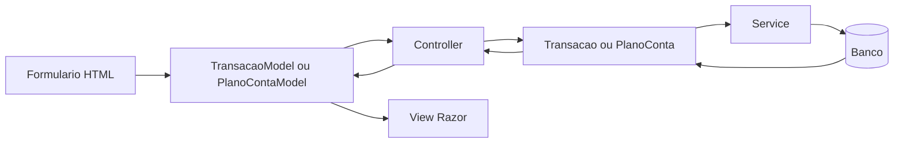
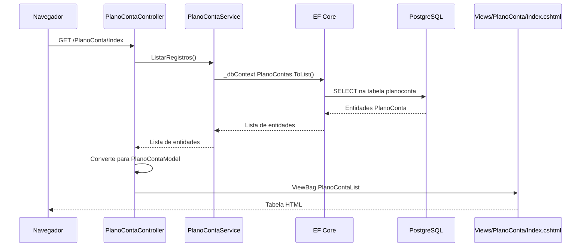
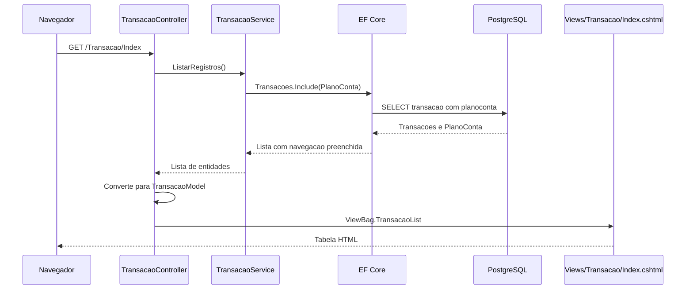
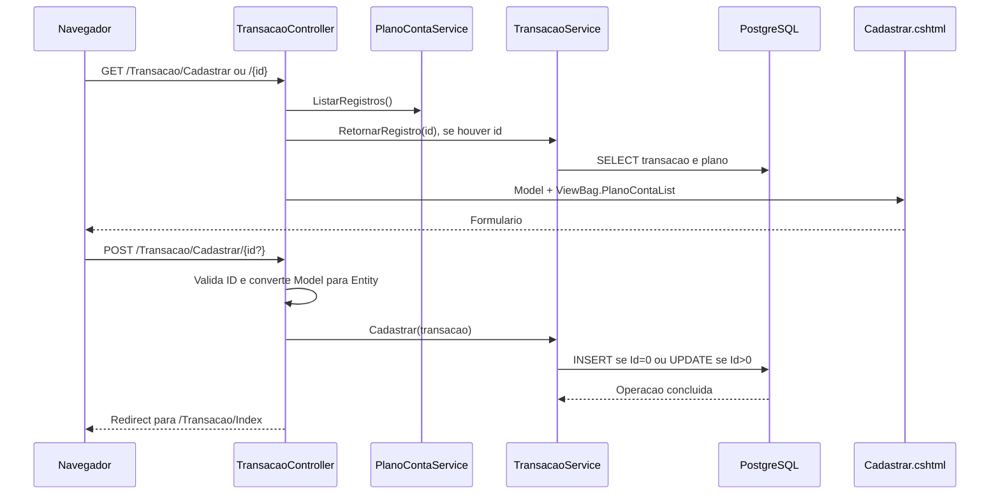
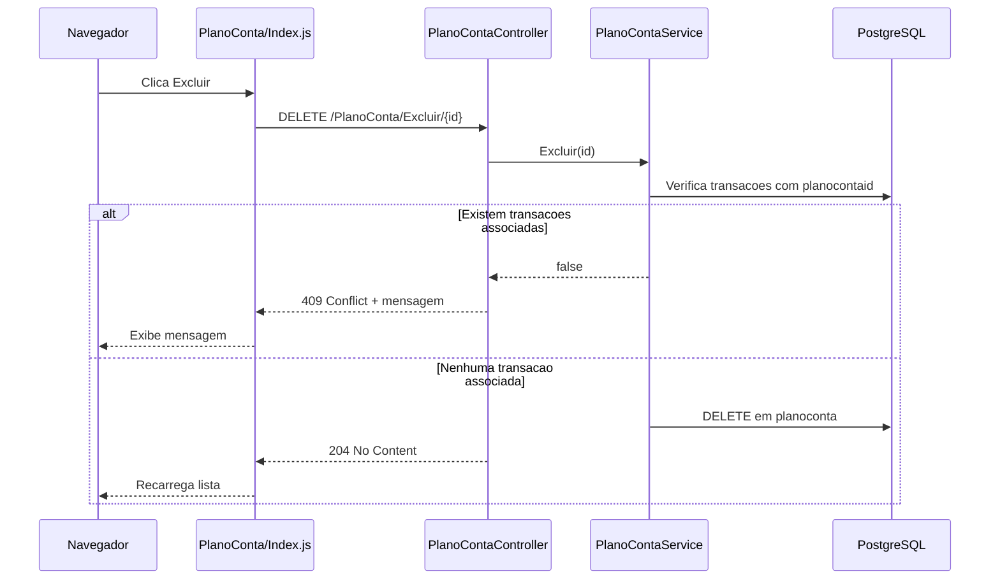

# MyFinance Web

Aplicacao web de controle financeiro criada com ASP.NET Core MVC, .NET 8, Entity Framework Core e PostgreSQL 16.

Este documento explica o funcionamento interno do projeto em uma linguagem voltada tambem para quem esta conhecendo ASP.NET MVC.

## 1. Visao geral

A aplicacao permite:

- cadastrar, editar, listar e excluir planos de contas;
- cadastrar, editar, listar e excluir transacoes;
- associar cada transacao a um plano de contas;
- armazenar os dados em PostgreSQL.

O fluxo principal e:



Cada camada tem uma responsabilidade:

| Camada | Responsabilidade | Projeto ou pasta |
| --- | --- | --- |
| Interface | Recebe cliques, formulários e devolve HTML | `MyFinanceWeb.Mvc` |
| Controller | Decide qual operacao executar e prepara a View | `MyFinanceWeb.Mvc/Controllers` |
| Model MVC | Representa os dados usados pelos formularios e telas | `MyFinanceWeb.Mvc/Models` |
| Service | Concentra as operacoes de negocio e acesso aos dados | `MyFinanceWeb.Service` |
| Interface de Service | Define os contratos usados pelos Controllers | `MyFinanceWeb.Service/Interfaces` |
| Entity | Representa os registros persistidos no banco | `MyFinanceWeb.Domain/Entities` |
| Infraestrutura | Configura o EF Core e o mapeamento para PostgreSQL | `MyFinanceWeb.Infra` |
| Banco | Persiste tabelas, chaves e relacionamentos | PostgreSQL via Docker |

## 2. Estrutura dos projetos

```text
myfinance-web-dotnet/
|-- compose.yaml                         # Executa o PostgreSQL
|-- .env                                 # Senha local, ignorada pelo Git
|-- database/init.sql                    # Cria as tabelas no primeiro start
|-- myfinance-web-dotnet.slnx            # Solucao .NET
|-- MyFinanceWeb.Domain/
|   |-- Entities/PlanoConta.cs           # Entidade de plano de contas
|   |-- Entities/Transacao.cs            # Entidade de transacao
|-- MyFinanceWeb.Infra/
|   |-- MyFinanceDbContext.cs            # DbSets e mapeamento EF/PostgreSQL
|-- MyFinanceWeb.Service/
|   |-- Interfaces/                      # Contratos dos servicos
|   |-- PlanoContaService.cs             # Operacoes de plano de contas
|   |-- TransacaoService.cs              # Operacoes de transacao
|-- MyFinanceWeb.Mvc/
	|-- Program.cs                        # Inicializacao e injecao de dependencia
	|-- Controllers/                     # Endpoints MVC
	|-- Models/                          # Modelos de tela
	|-- Views/                           # HTML Razor
	|-- wwwroot/js/                      # JavaScript do navegador
	|-- appsettings.json                 # Configuracao sem senha
```

## 3. Dependencias entre projetos



As referencias sao intencionais:

- `Domain` nao depende de nenhum outro projeto. E a camada mais simples.
- `Infra` depende de `Domain` para conhecer as entidades e fornece o `MyFinanceDbContext`.
- `Service` depende de `Domain` e `Infra` para executar operacoes sobre as entidades.
- `Mvc` depende das tres camadas e e o ponto de entrada da aplicacao.

Os arquivos `.csproj` registram essas dependencias com `ProjectReference`.

## 4. Inicializacao da aplicacao

O arquivo [Program.cs](MyFinanceWeb.Mvc/Program.cs) e executado primeiro.



### Arquivos de configuracao

O arquivo `.env` fica na raiz e nao deve ser versionado:

```env
POSTGRES_PASSWORD=123456
```

O `.gitignore` ja contem a regra `.env`.

O [appsettings.json](MyFinanceWeb.Mvc/appsettings.json) contem os dados nao sensiveis:

```json
{
  "ConnectionStrings": {
	"DefaultConnection": "Host=localhost;Port=5432;Database=myfinance;Username=postgres"
  }
}
```

Em `Program.cs`, `DotNetEnv.Env.NoClobber().TraversePath().Load()` procura o `.env` no diretorio atual ou em diretorios pai. Depois, `POSTGRES_PASSWORD` e lida com `Environment.GetEnvironmentVariable`.

A senha nao deve ser colocada em `appsettings.json`, no `Program.cs`, no `MyFinanceDbContext` ou no `compose.yaml`.

Em producao, prefira uma variavel de ambiente ou um gerenciador de secrets em vez de um arquivo `.env`.

## 5. Banco de dados com Docker Compose

O [compose.yaml](compose.yaml) executa `postgres:16` com:

- container `postgres16`;
- porta local `5432` encaminhada para a porta `5432` do container;
- banco inicial `myfinance`;
- usuario `postgres`;
- senha lida de `${POSTGRES_PASSWORD}` no `.env`;
- volume persistente `postgres_data`;
- script `database/init.sql` montado em `/docker-entrypoint-initdb.d/init.sql`.



O [database/init.sql](database/init.sql) cria as tabelas:

```sql
CREATE TABLE IF NOT EXISTS planoconta (...);
CREATE TABLE IF NOT EXISTS transacao (...);
```

### Comandos do banco

Na raiz do projeto:

```bash
# Validar a configuracao
docker compose config

# Iniciar o banco em segundo plano
docker compose up -d

# Verificar o container
docker compose ps

# Ver os logs
docker compose logs -f postgres

# Parar os servicos sem remover os dados
docker compose down
```

Os scripts de `/docker-entrypoint-initdb.d` sao executados somente quando o volume de dados esta vazio. Para recriar o banco e executar o script novamente:

```bash
docker compose down -v
docker compose up -d
```

O comando `down -v` apaga o volume e todos os dados armazenados nele. Use-o somente quando isso for desejado.

## 6. Injecao de dependencia

O ASP.NET Core cria automaticamente os objetos registrados em `Program.cs` e os entrega aos Controllers.

```csharp
builder.Services.AddScoped<IPlanoContaService, PlanoContaService>();
builder.Services.AddScoped<ITransacaoService, TransacaoService>();
```

Por exemplo, o `TransacaoController` declara `ITransacaoService` e `IPlanoContaService` no construtor. O framework resolve as implementacoes registradas sem o Controller precisar usar `new`.

`AddScoped` cria uma instancia por requisicao HTTP. Isso combina com o ciclo de vida do `DbContext`, que tambem e registrado por requisicao por `AddDbContext`.

## 7. Entidades, tabelas e relacionamento

### PlanoConta

Entidade em [PlanoConta.cs](MyFinanceWeb.Domain/Entities/PlanoConta.cs):

| Propriedade | Tipo C# | Coluna PostgreSQL |
| --- | --- | --- |
| `Id` | `int` | `id` |
| `Descricao` | `string` | `descricao` |
| `Tipo` | `char` | `tipo` |

### Transacao

Entidade em [Transacao.cs](MyFinanceWeb.Domain/Entities/Transacao.cs):

| Propriedade | Tipo C# | Coluna PostgreSQL |
| --- | --- | --- |
| `Id` | `int` | `id` |
| `Historico` | `string` | `historico` |
| `Data` | `DateTime` | `data` |
| `Valor` | `decimal` | `valor` |
| `PlanoContaId` | `int` | `planocontaid` |
| `PlanoConta` | `PlanoConta` | relacionamento |

O relacionamento e muitos-para-um: varias transacoes podem apontar para um plano de contas.



O [MyFinanceDbContext.cs](MyFinanceWeb.Infra/MyFinanceDbContext.cs) mapeia explicitamente nomes de tabelas e colunas para evitar a diferenca entre as convencoes do C# (`PlanoContas`, `PlanoContaId`) e os nomes minúsculos do PostgreSQL (`planoconta`, `planocontaid`). A propriedade `Data` e mapeada como `date`, pois a tabela nao armazena horario nem fuso.

## 8. Controllers e rotas

Os Controllers usam `[Route("[controller]")]`. Assim, o nome do Controller vira parte da URL.

| Controller | Metodo | HTTP | Rota | Funcao |
| --- | --- | --- | --- | --- |
| `PlanoContaController` | `Index` | GET | `/PlanoConta/Index` | Lista planos |
| `PlanoContaController` | `Cadastrar` | GET | `/PlanoConta/Cadastrar/{id?}` | Abre inclusao ou edicao |
| `PlanoContaController` | `Cadastrar` | POST | `/PlanoConta/Cadastrar/{id?}` | Salva inclusao ou edicao |
| `PlanoContaController` | `Excluir` | DELETE | `/PlanoConta/Excluir/{id}` | Exclui plano sem dependencias |
| `TransacaoController` | `Index` | GET | `/Transacao/Index` | Lista transacoes |
| `TransacaoController` | `Cadastrar` | GET | `/Transacao/Cadastrar/{id?}` | Abre inclusao ou edicao |
| `TransacaoController` | `Cadastrar` | POST | `/Transacao/Cadastrar/{id?}` | Salva inclusao ou edicao |
| `TransacaoController` | `Excluir` | DELETE | `/Transacao/Excluir/{id}` | Exclui transacao |

Quando o ID e omitido no GET de `Cadastrar`, o Controller prepara um model novo. Quando o ID existe, busca o registro, converte a entidade em um model de tela e devolve a View.

## 9. Diferenca entre Entity e Model MVC

As entidades representam o banco e vivem no projeto `Domain`. Os models MVC representam o que a tela precisa e vivem no projeto `Mvc`.



Essa conversao acontece no Controller. Por exemplo, o POST de transacao recebe `TransacaoModel`, cria uma `Transacao` e envia a entidade para `ITransacaoService`.

## 10. Fluxo de listagem

### Planos de contas



Arquivos envolvidos:

1. `PlanoContaController.Index` recebe a requisicao.
2. `IPlanoContaService` define `ListarRegistros`.
3. `PlanoContaService.ListarRegistros` consulta `DbSet<PlanoConta>`.
4. `MyFinanceDbContext` converte a consulta para a tabela `planoconta`.
5. `Views/PlanoConta/Index.cshtml` percorre `ViewBag.PlanoContaList`.
6. `wwwroot/js/PlanoConta/Index.js` cuida dos cliques de novo, editar e excluir.

### Transacoes

`TransacaoService.ListarRegistros` usa `Include(t => t.PlanoConta)` porque a lista mostra tambem o tipo do plano associado. Sem esse carregamento, `transacao.PlanoConta.Tipo` nao estaria disponivel.



## 11. Fluxo de cadastro e edicao

O mesmo par de actions `Cadastrar` atende inclusao e edicao.



No cadastro novo, `Data` recebe `DateTime.Today` no Controller. Na edicao, a data existente e mantida.

O campo `Valor` possui um campo visual em formato brasileiro (`1.234,56`) e um campo oculto com o valor numerico enviado ao model binder. O arquivo [Cadastrar.js](MyFinanceWeb.Mvc/wwwroot/js/Transacao/Cadastrar.js) sincroniza os dois campos antes do POST.

O campo `Data` continua sendo um `@Html.TextBoxFor` com `type="date"`. O HTML exige que o valor enviado ao controle esteja em `yyyy-MM-dd`; a forma visual `dd/MM/yyyy` depende do navegador e do locale configurado em `_Layout.cshtml` (`pt-BR`).

## 12. Fluxo de exclusao

### Excluir uma transacao

1. O usuario clica em `Excluir` em `Views/Transacao/Index.cshtml`.
2. `wwwroot/js/Transacao/Index.js` envia `DELETE /Transacao/Excluir/{id}` com `fetch`.
3. `TransacaoController.Excluir` chama `ITransacaoService.Excluir`.
4. `TransacaoService` busca a transacao, remove-a e chama `SaveChanges`.
5. O Controller retorna `204 No Content`.
6. O JavaScript recarrega a lista.

### Excluir um plano de contas

Uma transacao possui uma chave estrangeira para `planoconta`. Por isso, um plano usado por transacoes nao pode ser apagado.



Essa verificacao em `PlanoContaService.Excluir` evita deixar a excecao de chave estrangeira chegar ao usuario. A regra de banco continua existindo como ultima protecao.

## 13. Views, layout e JavaScript

### Layout compartilhado

`Views/Shared/_Layout.cshtml` e aplicado por `Views/_ViewStart.cshtml`. Ele fornece:

- Bootstrap;
- CSS global;
- jQuery;
- `site.js`;
- a secao opcional `Scripts` de cada View.

`Views/_ViewImports.cshtml` importa os namespaces MVC e os Tag Helpers, permitindo usar `asp-for`, `asp-action` e `asp-controller`.

Cada tela pode carregar um JavaScript especifico:

```cshtml
@section Scripts {
	<script src="~/js/Transacao/Cadastrar.js" asp-append-version="true"></script>
}
```

`asp-append-version` adiciona uma versao baseada no arquivo para evitar cache antigo do navegador.

### Arquivos das telas

| Tela | View | JavaScript |
| --- | --- | --- |
| Lista de planos | `Views/PlanoConta/Index.cshtml` | `wwwroot/js/PlanoConta/Index.js` |
| Cadastro de plano | `Views/PlanoConta/Cadastrar.cshtml` | somente scripts do layout |
| Lista de transacoes | `Views/Transacao/Index.cshtml` | `wwwroot/js/Transacao/Index.js` |
| Cadastro de transacao | `Views/Transacao/Cadastrar.cshtml` | `wwwroot/js/Transacao/Cadastrar.js` |

## 14. Como executar do zero

Pre-requisitos:

- .NET SDK compativel com `net8.0`;
- Docker e Docker Compose;
- porta `5432` livre;
- `.env` na raiz com `POSTGRES_PASSWORD`.

Passos:

```bash
# 1. Iniciar o banco e criar as tabelas no primeiro volume
docker compose up -d

# 2. Restaurar dependencias e compilar
dotnet build MyFinanceWeb.Mvc/MyFinanceWeb.Mvc.csproj

# 3. Iniciar a aplicacao com o perfil HTTPS
dotnet run --project MyFinanceWeb.Mvc/MyFinanceWeb.Mvc.csproj --launch-profile https
```

Acesse:

- `https://localhost:7291/PlanoConta/Index`
- `https://localhost:7291/Transacao/Index`

O perfil `https` esta em `MyFinanceWeb.Mvc/Properties/launchSettings.json` e define o ambiente `Development`.

## 15. Diagnostico de problemas comuns

### `Value cannot be null` no `UseNpgsql`

Verifique se `DefaultConnection` existe em `appsettings.json` e se o `.env` possui `POSTGRES_PASSWORD`. A aplicacao falha cedo com uma mensagem explicita quando uma dessas configuracoes nao existe.

### `database "myfinance" does not exist`

O container pode estar usando outro banco ou ter sido criado antes da configuracao atual. Confira `docker compose ps` e o bloco `POSTGRES_DB`. Para recriar os dados desde o inicio, use `docker compose down -v` seguido de `docker compose up -d`, lembrando que isso apaga o volume.

### `relation "planoconta" does not exist`

A tabela nao foi criada no banco `myfinance`. O script `database/init.sql` so roda na primeira inicializacao do volume. Recrie o volume ou execute o script manualmente conectado ao banco correto.

### Data nao aparece no campo de edicao

Um `input type="date"` exige `value` em `yyyy-MM-dd`. A View usa `@Html.TextBoxFor` com esse formato. A aparencia `dd/MM/yyyy` e controlada pelo navegador e pelo locale do sistema.

### Nao e possivel excluir um plano

O plano possui transacoes associadas. Exclua ou altere primeiro essas transacoes; essa protecao evita quebrar a chave estrangeira `transacao_planocontaid_fkey`.

### O dropdown de plano aparece vazio

O GET de `TransacaoController.Cadastrar` precisa preencher `ViewBag.PlanoContaList`. A View usa `Id` como valor e `Descricao` como texto visivel.

## 16. Evolucao recomendada

O projeto funciona com o script SQL inicial, mas as seguintes melhorias sao recomendadas para evolucao:

- criar migrations do Entity Framework Core para versionar alteracoes de schema;
- substituir `ViewBag` por ViewModels tipados contendo a lista de planos;
- adicionar validacao de `PlanoContaId`, data e valor no servidor;
- adicionar antiforgery token e avaliar protecoes adicionais para endpoints DELETE;
- criar testes unitarios para os Services e testes de integracao para os Controllers;
- usar secrets de ambiente em producao em vez de `.env`.
